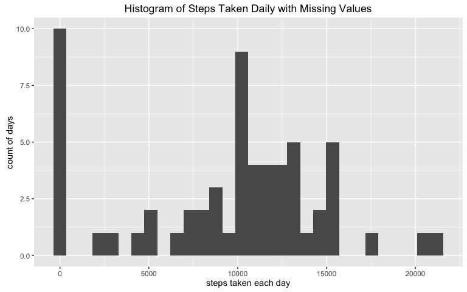
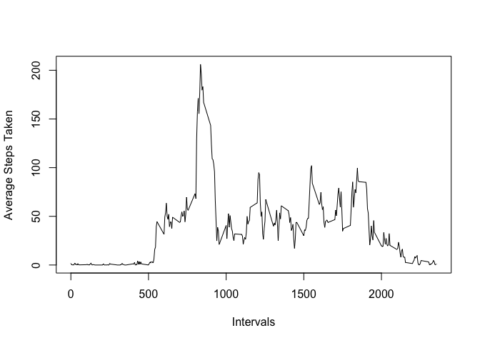
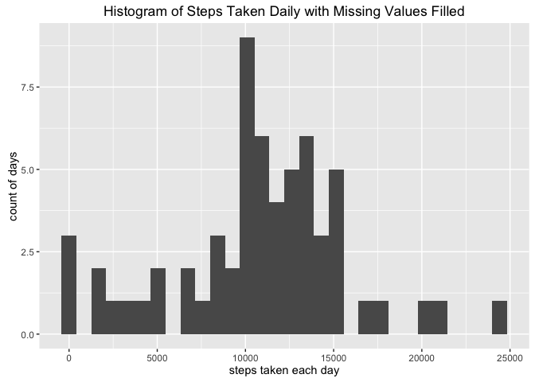
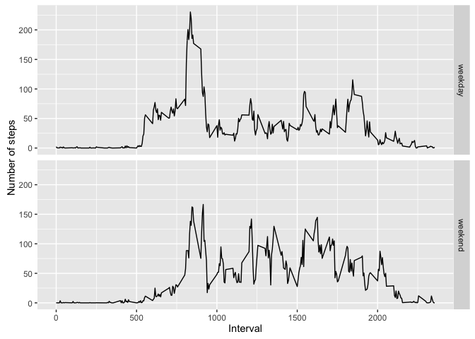

# Reproducible Research: Peer Assessment 1

##1. Loading and preprocessing the data
Check if the dataset exists already in the working directory. If not, download the datasets and unzip them into the WD.

```r
if (!file.exists("./activity.zip")) {
URL <- "https://d396qusza40orc.cloudfront.net/repdata%2Fdata%2Factivity.zip"
download.file(URL,"./activity.zip")}
unzip("./activity.zip", "activity.csv")
```

Load the data into R

```r
activity <- read.csv("./activity.csv")
```

##2. What is the mean total number of steps taken per day?
###2.1. Calculate the total number of steps taken per day

```r
stepsperday <- aggregate(activity$steps,
                         by=list(activity$date), FUN = sum, na.rm = TRUE)
colnames(stepsperday) <- c("date","daysteps")
```

###2.2. Make a histogram of the total number of steps taken each day

```r
library(ggplot2)
hist <- qplot(daysteps,data=stepsperday) +
  xlab("steps taken each day") + ylab("count of days") + 
  ggtitle("Histogram of Steps Taken Daily with Missing Values")
print(hist)
```

```
## `stat_bin()` using `bins = 30`. Pick better value with `binwidth`.
```

<!-- -->

###2.3. Calculate and report the mean and median of the total number of steps taken per day

```r
stepsperday_mean <- sum(stepsperday$daysteps)/length(stepsperday$date)
stepsperday_median <- median(stepsperday$daysteps)
print(stepsperday_mean)
```

```
## [1] 9354.23
```

```r
print(stepsperday_median)
```

```
## [1] 10395
```

##3. What is the average daily activity pattern?
###3.1. Make a time series plot (i.e. type = "l") of the 5-minute interval (x-axis) and the average number of steps taken, averaged across all days (y-axis)
- Calculate the average number of steps taken at each interval, averaged across all days

```r
avg_steps_interval <- aggregate (activity$steps,by = 
                                   list(activity$interval), 
                                 FUN = mean, na.rm = TRUE)
colnames(avg_steps_interval) <- c("interval","avg_steps")
```

- Plot the average number of steps across the 5-minute intervals

```r
with(avg_steps_interval, plot(interval,avg_steps,type="l", xlab="Intervals", 
                              ylab="Average Steps Taken"))
```

<!-- -->

###3.2. Which 5-minute interval, on average across all the days in the dataset, contains the maximum number of steps?
- The 5-minute interval with maximum average number of steps can be identified by:

```r
max_avg_steps_interval <- avg_steps_interval[which.max(avg_steps_interval$avg_steps),1]
print(max_avg_steps_interval)
```

```
## [1] 835
```
  which gives us the interval **835**, with 104 steps

##4. Imputing missing values
###4.1. Calculate and report the total number of missing values in the dataset

```r
NA_count <- sum(is.na(activity$steps))
print(NA_count)
```

```
## [1] 2304
```
There are in total **2304** missing values in the dataset

###4.2. Devise a strategy for filling in all of the missing values in the dataset.
Since the steps taken during a day may significantly vary depending on time of the day (eg. a person is expected to be more active during daytime than at night), I will use the average steps taken at the same interval to fill the missing values.

- Subset the rows with missing values and the ones without missing values

```r
activity_NA <- activity[is.na(activity$steps),]
activity_NNA <- activity[is.na(activity$steps)==FALSE,]
```
- Replace the subset with missing values (activity_NA) with the average steps taken at each interval

```r
activity_NA_filled <- merge(activity_NA, avg_steps_interval, 
                            by="interval")[,c(4,3,1)]
colnames(activity_NA_filled) <- c("steps","date","interval")
```

###4.3. Create a new dataset that is equal to the original dataset but with the missing data filled in.
Recombine the NA-filled subset and the non-NA subset from the previsous step into the new dataset with missing data filled in

```r
activity_new <- rbind(activity_NA_filled, activity_NNA)
```

###4.4. Make a histogram of the total number of steps taken each day and Calculate and report the mean and median total number of steps taken per day. Do these values differ from the estimates from the first part of the assignment? What is the impact of imputing missing data on the estimates of the total daily number of steps?

- Calculate the total number of steps taken per day based on the new dataset

```r
stepsperday_new <- aggregate(activity_new$steps, by = list(activity$date),
                             FUN = sum, na.rm = TRUE)
colnames(stepsperday_new) <- c("date","daysteps")
```

- Make a histogram of the total number of steps taken each day

```r
hist_new <- qplot(daysteps,data=stepsperday_new) + 
  xlab("steps taken each day")+ylab("count of days") + 
  ggtitle("Histogram of Steps Taken Daily with Missing Values Filled")
print(hist_new)
```

```
## `stat_bin()` using `bins = 30`. Pick better value with `binwidth`.
```

<!-- -->

- Calculate and report the mean and median total number of steps taken per day

```r
stepsperday_mean_new <- sum(stepsperday_new$daysteps)/length(stepsperday_new$date)
stepsperday_median_new <- median(stepsperday_new$daysteps)
print(stepsperday_mean_new)
```

```
## [1] 10766.19
```

```r
print(stepsperday_median_new)
```

```
## [1] 11015
```
- Both the mean and median steps taken increased after imputting the missing values.

##5. Are there differences in activity patterns between weekdays and weekends?
###5.1. Create a new factor variable in the dataset with two levels – “weekday” and “weekend” indicating whether a given date is a weekday or weekend day.
- Add the additional column of weekdays

```r
activity_new_wd <- cbind(activity_new,weekdays(as.Date(activity_new$date,"%Y-%m-%d")),stringsAsFactors = FALSE)
colnames(activity_new_wd) <- c("steps","date","interval","weekdays")
```

- Group the values into two levels: weekend and weekday

```r
activity_new_wd$weekdays[activity_new_wd$weekdays %in% c("Sunday","Saturday")] <- "weekend"
activity_new_wd$weekdays[activity_new_wd$weekdays %in% c("Monday","Tuesday","Wednesday","Thursday","Friday")] <- "weekday"
```

###5.2. Make a panel plot containing a time series plot (i.e. type = "l") of the 5-minute interval (x-axis) and the average number of steps taken, averaged across all weekday days or weekend days (y-axis). See the README file in the GitHub repository to see an example of what this plot should look like using simulated data.
- Calculate the average number of steps taken at each interval and at weekend vs weekday, averaged across all days

```r
avg_steps_interval_new <- aggregate (activity_new_wd$steps,by=list(activity_new_wd$interval,activity_new_wd$weekdays), FUN=mean, na.rm=TRUE)
colnames(avg_steps_interval_new) <- c("interval","weekdays","avg_steps")
```

- Plot the average number of steps across the 5-minute intervals on weekend and weekdays

```r
panel_plot <- ggplot(avg_steps_interval_new, aes(interval, avg_steps)) +
  geom_line() + facet_grid(weekdays ~.) + 
  xlab("Interval") + ylab("Number of steps")
panel_plot
```

<!-- -->
