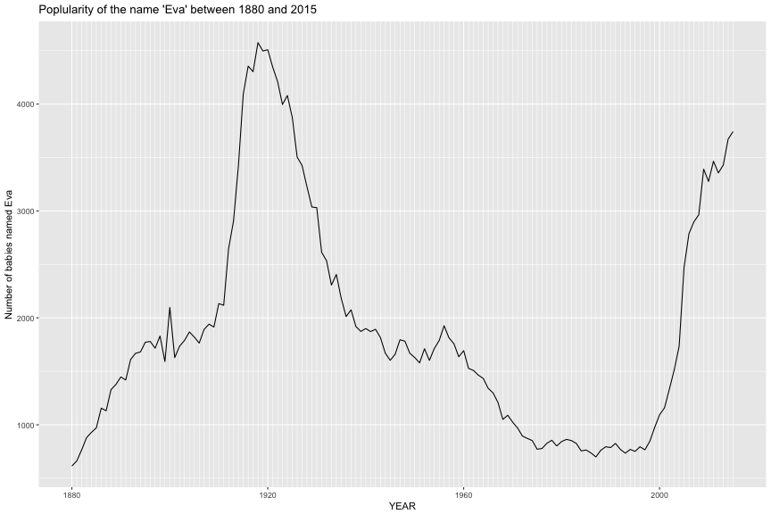

<style>
.title-slide {
  background-color: #FFFFFF; /* #EDE0CF; ; #CA9F9D*/
}
</style>

## The perfect name

- Trying to pick the perfect baby name? Have a name in mind but want to find more about its popularity?

- The Shiny app uses the Social Security Administration (SSA)'s baby name data, based on Social Security card applications for births occured in the United States after 1897.

- More information regarding the data set can be found at the SSA's website:
https://www.ssa.gov/oact/babynames/limits.html. This includes all names with at least 5 uses.

- Two data sets are provided ("National data" and "State-specific data"). Since this app does not involve geographic visualizations, only the "National data" is used.

--- .smallcode

## Getting and loading the data


```r
if (file.exists("./data_inputs/names.zip") == FALSE) {
        url1 <- "https://www.ssa.gov/oact/babynames/names.zip"
        download.file(url1, "./data_inputs/names.zip")
        unzip("./data_inputs/names.zip", exdir = "./data_inputs/names")
}

## load required packages
suppressMessages(library(dplyr));library(slidify);library(ggplot2)

## create a list of the files and the corresponding year the file represent
list_names <- list.files("./data_inputs/names",
                         pattern = "txt", full.names = TRUE) %>% 
        data.frame(FILE_PATH = ., stringsAsFactors = FALSE) %>%
        mutate(YEAR = as.numeric(gsub("[^0-9]", "", .$FILE_PATH)))

## import the data and add the 'year' as an additional variable so that the
## consolidated data frame is ready for analysis
names <-data.frame()
for (i in seq_along(list_names$FILE_PATH)) {
        names0 <- read.table(list_names$FILE_PATH[i], sep = ",",
                             col.names = c("NAME", "GENDER", "COUNT"))
        names0$YEAR <- list_names$YEAR[i]
        names <- rbind(names, names0)
}
```

--- .smallcode

## Data Analysis Question

For this Shiny app, we will focus on: **How has the popularity of a baby name changed over time?**

- For example, we can take a look at how the popularity of the name "Eva" has changed over the years
- The code below plots the count of the baby named "Eva" over the whole period where data is available (see the next slide for the plot)
- For the shiny app, we will build something reactive so that each user can explore the topic without having to code


```r
## select name and years to view the trend
enter_name <- "Eva"; year_range <- c(1880, 2015)
filtered_data <- filter(names, NAME == enter_name, YEAR >= year_range[1], 
                        YEAR <= year_range[2]) %>%
        group_by(NAME, YEAR) %>% summarise(COUNT = sum(COUNT))

## visualize the trend
ggplot(filtered_data, aes(x = YEAR, y = COUNT)) + geom_line() +
        scale_x_continuous(minor_breaks = seq(year_range[1],year_range[2], by = 1)) +
        labs(title = paste0("Poplularity of the name \'", enter_name,"' between ", year_range[1], 
                            " and ", year_range[2]),
             y = paste0("Number of babies named ", enter_name))
```

--- .class.id

